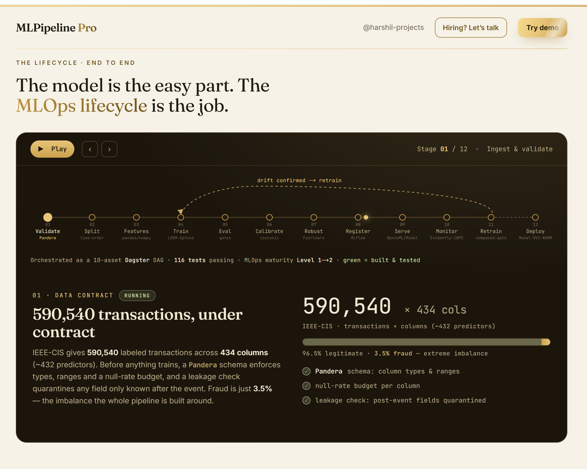

# MLPipeline Pro — real-time fraud-detection MLOps

**Live demo: [mlpipelinepro.harshilprojects.com](https://mlpipelinepro.harshilprojects.com)** ·
built and operated by [Harshil](https://github.com/harshil-projects) ·
📫 harshilprojects3@gmail.com

A production-shaped MLOps reference: one LightGBM model taken through the **entire
lifecycle** — validate → train → eval → register → serve → monitor → drift-retrain —
as a Dagster asset DAG, with fail-closed gates at every step and per-prediction
explanations in the serving path.

> **About this repo:** this is the project's public face — architecture, measured
> results, and governance evidence. The implementation is **private by design**;
> the live demo is public, and I'm happy to walk through the code in an interview.

## Headline results (measured, not extrapolated)

Benchmark: **IEEE-CIS Fraud Detection** — 590,540 real transactions × 434 columns,
~3.5% fraud, **time-ordered split** (train 413,378 / calibration 59,054 /
out-of-time eval 118,108) so nothing leaks from the future.

| Metric | Measured | Note |
|---|---|---|
| ROC-AUC (out-of-time) | **0.9151** | single LightGBM, 455 features, Optuna-tuned |
| PR-AUC (out-of-time) | **0.552** | the honest headline for 3.5% base-rate fraud |
| Recall @ precision 0.5 / 0.7 / 0.9 | 0.543 / 0.427 / 0.215 | operating-point menu, not one cherry-pick |
| Single model vs 5× ensemble | gap **0.0012 AUC** | the ensemble isn't worth 5× the latency — deliberate sub-100ms-SLA tradeoff |
| Calibration (isotonic) | ECE 0.0096 → **0.0064**, Brier 0.0217 | scores usable as probabilities |
| Throughput, no SHAP | **~7,100 rows/s/core** batched | 0.14 ms/row |
| Throughput, TreeSHAP in-path | **~51 rows/s/core** batched → ~200 RPS on a 4-core container | 19.5 ms/row; single-stream P95 138 ms (no SHAP) / 291 ms (with SHAP) |
| Drift → retrain demo | clean data: no retrain (AUC 0.916) · severe drift: **gate fires** (AUC 0.816) | both loops must agree before retraining |

## The pipeline



```
ingest ─► Pandera schema/quality gates (fail closed)
       ─► time-ordered split ─► Optuna (TPE) tuning ─► train (LightGBM)
       ─► eval gates: PR-AUC · recall@precision · segment robustness (Fairlearn, bootstrap CI)
       ─► MLflow registry — every run pinned to SHA-256 data fingerprint + git SHA
       ─► serve: BentoML-packaged scorer on Modal (CPU, scale-to-zero, $0 idle)
       ─► monitor: two-loop drift — Evidently PSI/KS (features) AND CBPE (label-free
          performance estimate bridging 7–60-day chargeback delay)
       ─► compound retrain gate: BOTH loops must fire (no single-signal thrashing)
       ─► challenger shadow-scores → alias promotion → one-command rollback
```

Design choices that carry the story:

- **Train/serve skew eliminated structurally** — a single fitted feature transform is
  serialized once and used identically at train and serve time.
- **Point-in-time-correct features** — Feast with backward `merge_asof` joins; no label
  or future leakage into training rows.
- **Fail-closed everywhere** — schema gates, eval gates, and CI gates block promotion;
  nothing ships on a warning.
- **Per-prediction explanations in-path** — native TreeSHAP (`pred_contrib`) per flagged
  transaction: an audit-ready "why flagged", not a post-hoc notebook.
- **Label-free monitoring** — fraud labels arrive 7–60 days late (chargebacks), so
  performance is estimated with CBPE between label drops (estimate 0.943 vs realized
  0.9151, ±0.028 — used as a trend tool, not gospel).

## Governance

- **Model card** auto-generated per candidate applying high-risk-style MRM controls
  (2026 interagency guidance, successor to SR 11-7) for human review before promotion.
- **Tamper-evident lineage** — SHA-256 hash chain over the audit trail, persisted to
  S3 Object Lock (WORM).
- **Cohort robustness as a merge gate** — no operational segment may fall below the
  global metric minus tolerance (bootstrap CI), enforced in CI, not in a slide.

## Stack

Python · LightGBM · Optuna · Dagster · MLflow · Feast · Evidently · CBPE ·
BentoML · Modal · Pandera · Fairlearn · SHAP · GitHub Actions · S3 Object Lock ·
Next.js (the live site)

## See it live

- **[mlpipelinepro.harshilprojects.com](https://mlpipelinepro.harshilprojects.com)** — the
  full interactive walkthrough: lifecycle, scorecard, drift demo, live scoring.
- More of my work: **[harshilprojects.com](https://harshilprojects.com)** ·
  **[TaxBrainAI](https://taxbrainai.harshilprojects.com)** (agentic tax advisor).

---

© Harshil. Documentation and results shared for evaluation; all rights reserved.
